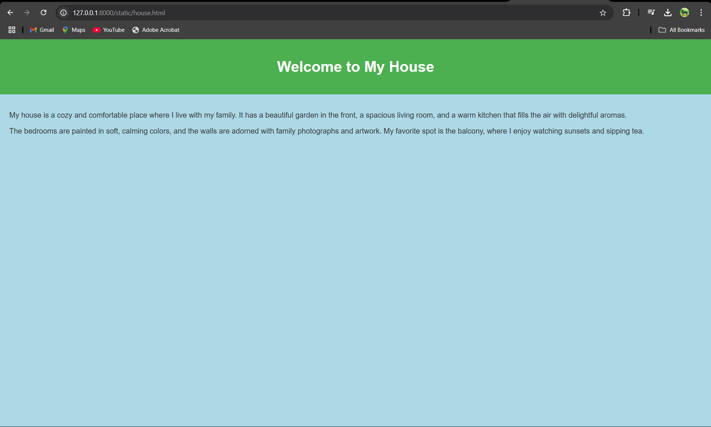
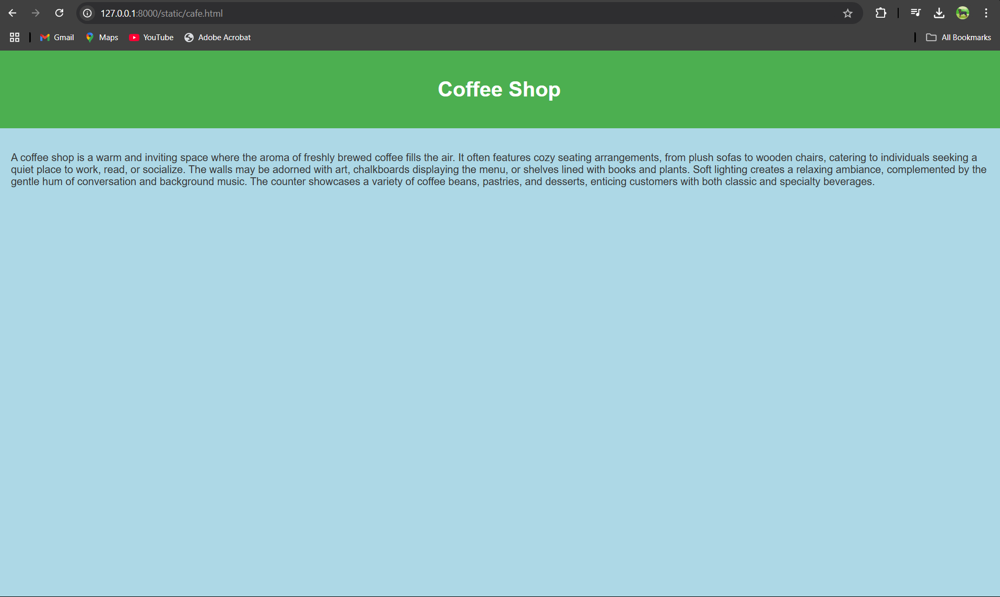
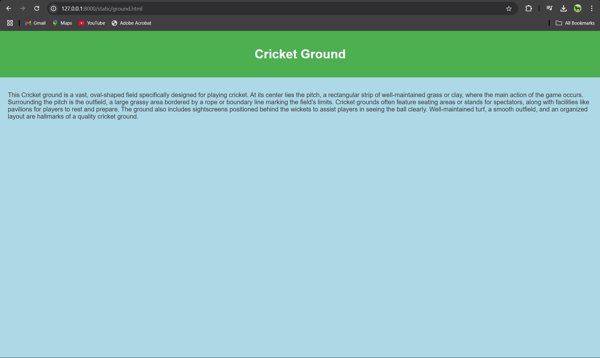
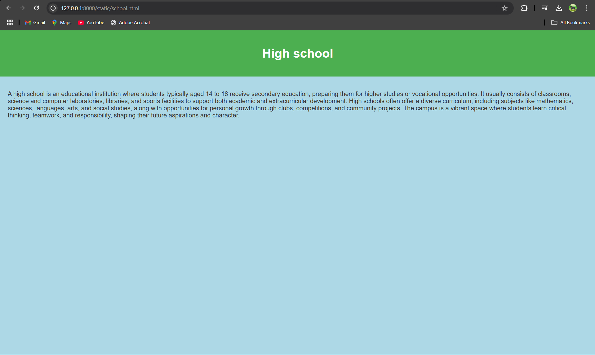
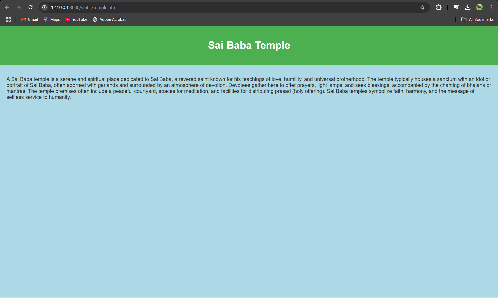
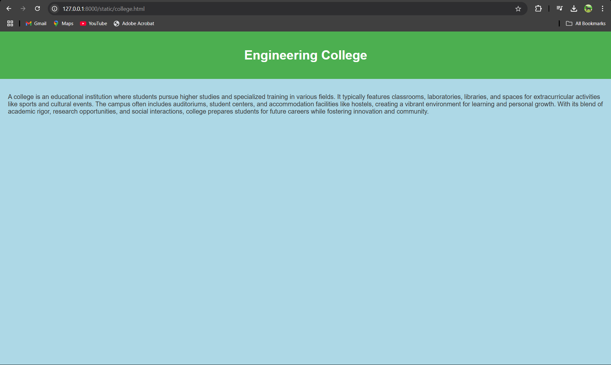

# Ex04 Places Around Me
## Date: 

## AIM
To develop a website to display details about the places around my house.

## DESIGN STEPS

### STEP 1
Create a Django admin interface.

### STEP 2
Download your city map from Google.

### STEP 3
Using ```<map>``` tag name the map.

### STEP 4
Create clickable regions in the image using ```<area>``` tag.

### STEP 5
Write HTML programs for all the regions identified.

### STEP 6
Execute the programs and publish them.

## CODE
~~~
map.html

<html>
<head>
    <title>My City</title>
</head>
<body>

    <h1 align="center">
        <font color="red"><b>Avadi</b></font>
    </h1>
    <h3 align="center">
      <font color="blue"><b>Allen W (24900645)</b></font>
    </h3>
    <center>
        
        <map name="MyCity">
            <area shape="rect" coords="579,388,617,418" title="My House" href="house.html">
            <area shape="rect" coords="391,99,427,114" title="Coffe Shop" href="cafe.html">
            <area shape="rect" coords="839,275,881,315" title="Cricket ground" href="ground.html">
            <area shape="rect" coords="277,150,316,185" title="Vel Tech College" href="college.html">
            <area shape="rect" coords="77,324,120,358" title="Sai Baba Temple" href="temple.html">
            <area shape="rect" coords="965,394,1011,434" title="High School" href="school.html">
        </map>
    </center>
</body>
</html>

house.html

<!DOCTYPE html>
<html lang="en">
<head>
    <meta charset="UTF-8">
    <meta name="viewport" content="width=device-width, initial-scale=1.0">
    <title>My House</title>
    <style>
        body {
            background-color: lightblue; /* Background color for the page */
            font-family: Arial, sans-serif; /* Sets the font style */
            margin: 0;
            padding: 0;
            color: #333;
        }
        header {
            background-color: #4CAF50; /* Green header background */
            color: white;
            padding: 20px;
            text-align: center;
        }
        .content {
            padding: 20px;
        }
    </style>
</head>
<body>
    <header>
        <h1>Welcome to My House</h1>
    </header>
    <div class="content">
        <p>My house is a cozy and comfortable place where I live with my family. It has a beautiful garden in the front, a spacious living room, and a warm kitchen that fills the air with delightful aromas.</p>
        <p>The bedrooms are painted in soft, calming colors, and the walls are adorned with family photographs and artwork. My favorite spot is the balcony, where I enjoy watching sunsets and sipping tea.</p>
    </div>
</body>
</html>

cafe.html

<!DOCTYPE html>
<html lang="en">
<head>
    <meta charset="UTF-8">
    <meta name="viewport" content="width=device-width, initial-scale=1.0">
    <title>My House</title>
    <style>
        body {
            background-color: lightblue; /* Background color for the page */
            font-family: Arial, sans-serif; /* Sets the font style */
            margin: 0;
            padding: 0;
            color: #333;
        }
        header {
            background-color: #4CAF50; /* Green header background */
            color: white;
            padding: 20px;
            text-align: center;
        }
        .content {
            padding: 20px;
        }
    </style>
</head>
<body>
    <header>
        <h1>Coffee Shop</h1>
    </header>
    <div class="content">
        <p>A coffee shop is a warm and inviting space where the aroma of freshly brewed coffee fills the air.
        It often features cozy seating arrangements, from plush sofas to wooden chairs, catering to individuals seeking a quiet place to work, read, or socialize. 
        The walls may be adorned with art, chalkboards displaying the menu, or shelves lined with books and plants. Soft lighting creates a relaxing ambiance, complemented by the gentle hum of conversation and background music. 
        The counter showcases a variety of coffee beans, pastries, and desserts, enticing customers with both classic and specialty beverages.</p>
    </div>
</body>
</html>

college.hmtl

<!DOCTYPE html>
<html lang="en">
<head>
    <meta charset="UTF-8">
    <meta name="viewport" content="width=device-width, initial-scale=1.0">
    <title>My House</title>
    <style>
        body {
            background-color: lightblue; /* Background color for the page */
            font-family: Arial, sans-serif; /* Sets the font style */
            margin: 0;
            padding: 0;
            color: #333;
        }
        header {
            background-color: #4CAF50; /* Green header background */
            color: white;
            padding: 20px;
            text-align: center;
        }
        .content {
            padding: 20px;
        }
    </style>
</head>
<body>
    <header>
        <h1>Engineering College</h1>
    </header>
    <div class="content">
        <p>A college is an educational institution where students pursue higher studies and specialized training in various fields. It typically features classrooms, laboratories, libraries, and spaces for extracurricular activities like sports and cultural events. The campus often includes auditoriums, student centers, and accommodation facilities like hostels, creating a vibrant environment for learning and personal growth. With its blend of academic rigor, research opportunities, and social interactions, college prepares students for future careers while fostering innovation and community.</p>
    </div>
</body>
</html>

ground.html

<!DOCTYPE html>
<html lang="en">
<head>
    <meta charset="UTF-8">
    <meta name="viewport" content="width=device-width, initial-scale=1.0">
    <title>My House</title>
    <style>
        body {
            background-color: lightblue; /* Background color for the page */
            font-family: Arial, sans-serif; /* Sets the font style */
            margin: 0;
            padding: 0;
            color: #333;
        }
        header {
            background-color: #4CAF50; /* Green header background */
            color: white;
            padding: 20px;
            text-align: center;
        }
        .content {
            padding: 20px;
        }
    </style>
</head>
<body>
    <header>
        <h1>Cricket Ground</h1>
    </header>
    <div class="content">
        <p>This Cricket ground is a vast, oval-shaped field specifically designed for playing cricket. At its center lies the pitch, a rectangular strip of well-maintained grass or clay, where the main action of the game occurs. Surrounding the pitch is the outfield, a large grassy area bordered by a rope or boundary line marking the field's limits. 
            Cricket grounds often feature seating areas or stands for spectators, along with facilities like pavilions for players to rest and prepare. The ground also includes sightscreens positioned behind the wickets to assist players in seeing the ball clearly. Well-maintained turf, a smooth outfield, and an organized layout are hallmarks of a quality cricket ground.</p>
    </div>
</body>
</html>

school.html

<!DOCTYPE html>
<html lang="en">
<head>
    <meta charset="UTF-8">
    <meta name="viewport" content="width=device-width, initial-scale=1.0">
    <title>My House</title>
    <style>
        body {
            background-color: lightblue; /* Background color for the page */
            font-family: Arial, sans-serif; /* Sets the font style */
            margin: 0;
            padding: 0;
            color: #333;
        }
        header {
            background-color: #4CAF50; /* Green header background */
            color: white;
            padding: 20px;
            text-align: center;
        }
        .content {
            padding: 20px;
        }
    </style>
</head>
<body>
    <header>
        <h1>High school</h1>
    </header>
    <div class="content">
        <p>A high school is an educational institution where students typically aged 14 to 18 receive secondary education, preparing them for higher studies or vocational opportunities. It usually consists of classrooms, science and computer laboratories, libraries, and sports facilities to support both academic and extracurricular development. High schools often offer a diverse curriculum, including subjects like mathematics, sciences, languages, arts, and social studies, along with opportunities for personal growth through clubs, competitions, and community projects. The campus is a vibrant space where students learn critical thinking, teamwork, and responsibility, shaping their future aspirations and character.</p>
    </div>
</body>
</html>

temple.html

<!DOCTYPE html>
<html lang="en">
<head>
    <meta charset="UTF-8">
    <meta name="viewport" content="width=device-width, initial-scale=1.0">
    <title>My House</title>
    <style>
        body {
            background-color: lightblue; /* Background color for the page */
            font-family: Arial, sans-serif; /* Sets the font style */
            margin: 0;
            padding: 0;
            color: #333;
        }
        header {
            background-color: #4CAF50; /* Green header background */
            color: white;
            padding: 20px;
            text-align: center;
        }
        .content {
            padding: 20px;
        }
    </style>
</head>
<body>
    <header>
        <h1>Sai Baba Temple</h1>
    </header>
    <div class="content">
        <p>A Sai Baba temple is a serene and spiritual place dedicated to Sai Baba, a revered saint known for his teachings of love, humility, and universal brotherhood. The temple typically houses a sanctum with an idol or portrait of Sai Baba, often adorned with garlands and surrounded by an atmosphere of devotion. Devotees gather here to offer prayers, light lamps, and seek blessings, accompanied by the chanting of bhajans or mantras. The temple premises often include a peaceful courtyard, spaces for meditation, and facilities for distributing prasad (holy offering). Sai Baba temples symbolize faith, harmony, and the message of selfless service to humanity.</p>
    </div>
</body>
</html>

~~~

## OUTPUT








## RESULT
The program for implementing image maps using HTML is executed successfully.
